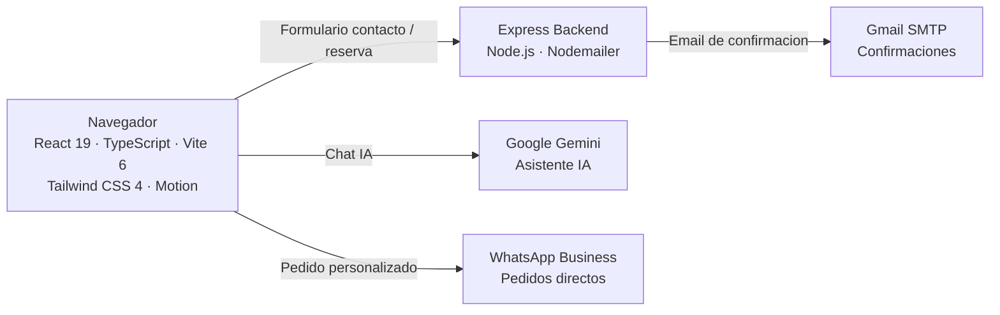
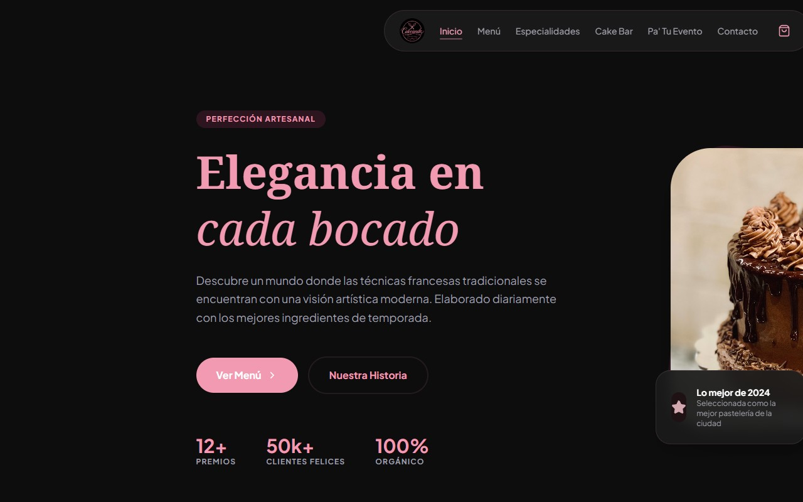

# Cakeando Sweets Bar

 
 

 

> **Sitio web full-stack para una boutique de reposteria artesanal en Panama — con catalogo interactivo, constructor de tortas personalizado y sistema de reservas para eventos.**

> Este es un **portfolio showcase** — el codigo fuente es propietario y no esta incluido.

---

## El Sitio

**[cakeandosweetsbar.sytes.net](https://cakeandosweetsbar.sytes.net/)** — sitio en produccion.

---

## El Problema

Una pasteleria artesanal en Panama necesitaba una presencia digital que transmitiera el nivel premium de sus productos y les permitiera:

- Mostrar su catalogo con disponibilidad actualizada sin depender de un desarrollador
- Recibir pedidos personalizados de tortas sin gestion manual de chats
- Gestionar reservas para su servicio de CakeBar en eventos
- Actualizar inventario y proximos eventos desde un panel simple

---

## La Solucion

Sitio web full-stack con React 19 y un backend Express ligero que maneja emails, persistencia de inventario y un asistente IA conversacional integrado directamente en la experiencia del cliente.

---

## Funcionalidades

| Funcionalidad | Descripcion |
|--------------|-------------|
| Constructor de Tortas | Asistente de 5 pasos (Base, Frosting, Relleno, Toppings, Drizzle) — genera pedido directo por WhatsApp |
| Catalogo de Menu | 5 categorias de productos con disponibilidad en tiempo real |
| Pa Tu Evento | Paquetes CakeBar (Basico / Premium / Luxury) con formulario de reserva |
| Asistente IA | Chat con Google Gemini para consultas sobre menu y servicios |
| Newsletter | Registro de suscriptores con confirmacion por email |
| Panel de Admin | Editor de inventario y eventos — acceso protegido solo para administradores |

---

## Arquitectura

---

## Stack Tecnologico

| Capa | Tecnologia |
|------|-----------|
| Frontend | React 19 · TypeScript · Vite 6 · Tailwind CSS 4 |
| Animaciones | Motion (Framer Motion v12) |
| Backend | Express 4 · Node.js |
| Email | Nodemailer + Gmail SMTP |
| IA | Google Gemini API |
| Datos | JSON files en servidor (sin base de datos) |
| Despliegue | Bluehost VPS · PM2 · Nginx |

---

## Vista Previa

---

## Contacto

El codigo fuente es propietario. Para consultas: [pablozam1931@gmail.com](mailto:pablozam1931@gmail.com)

---

*Parte del portfolio [deadlyrat](https://github.com/deadlyrat).*
