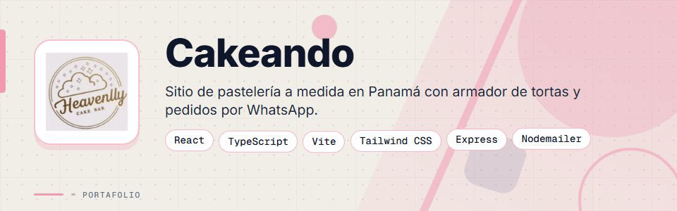
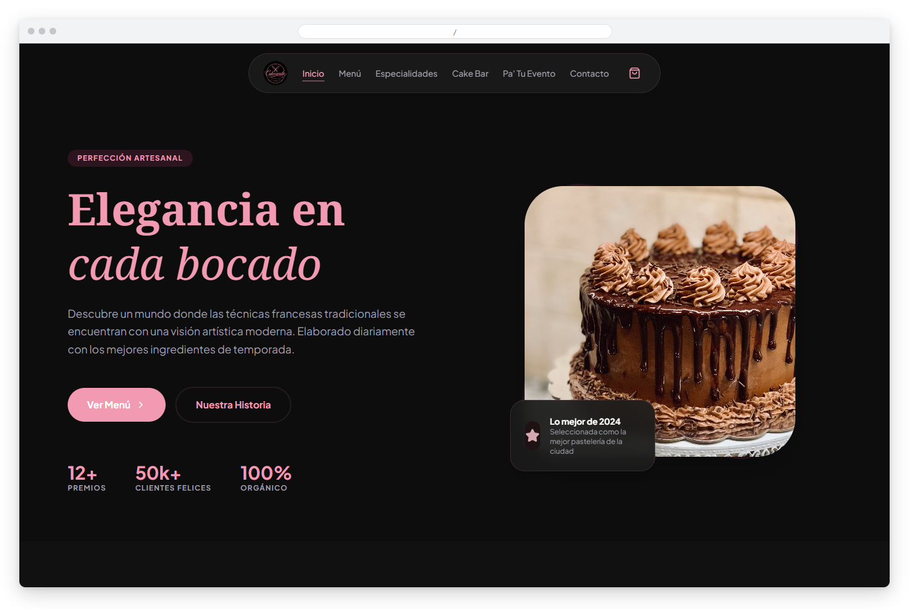
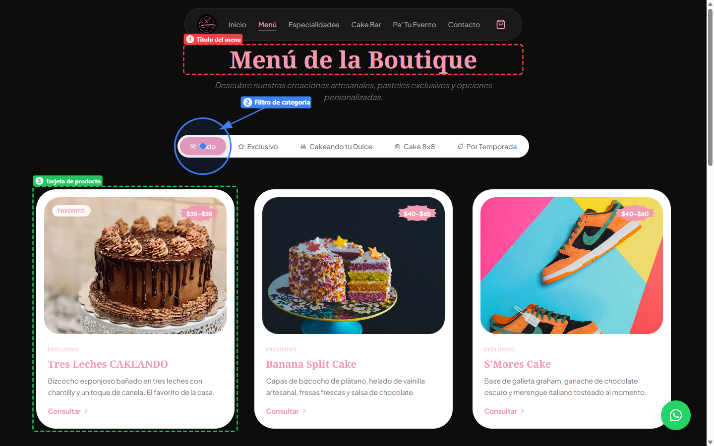
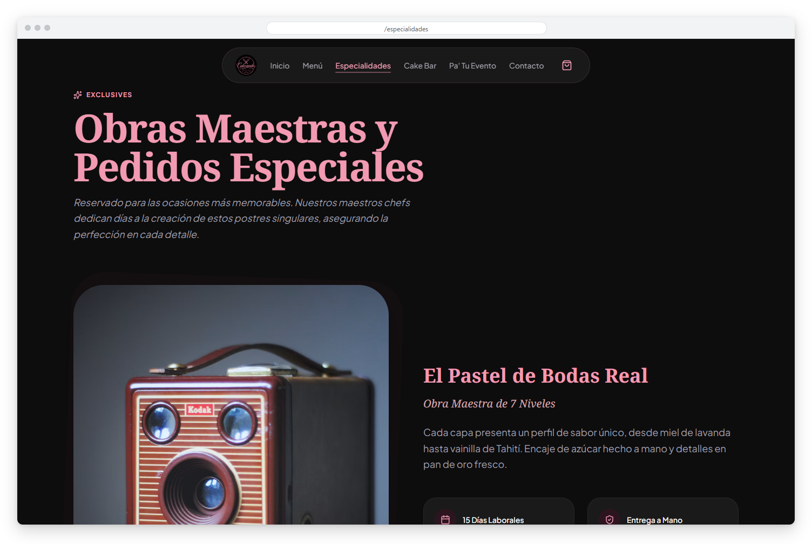
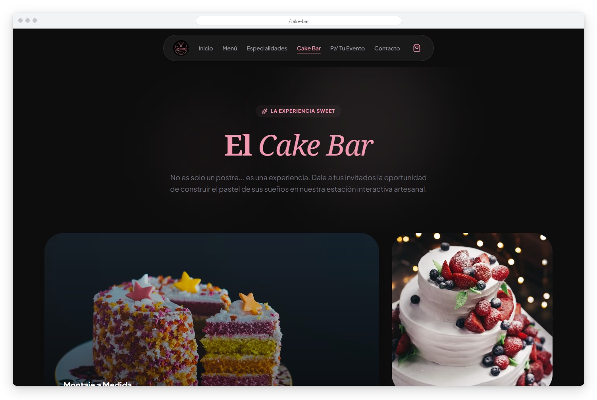
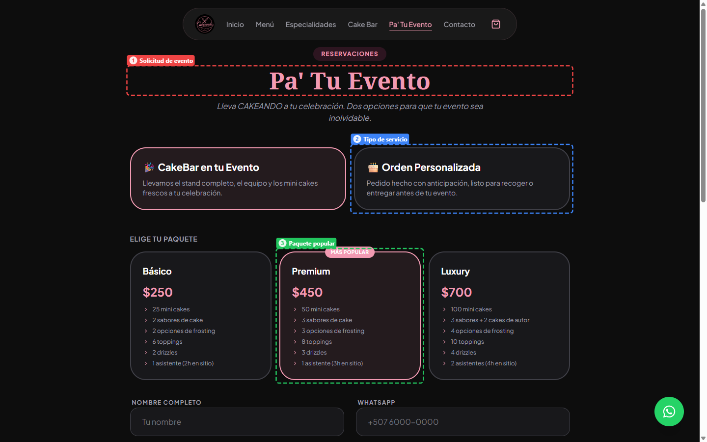
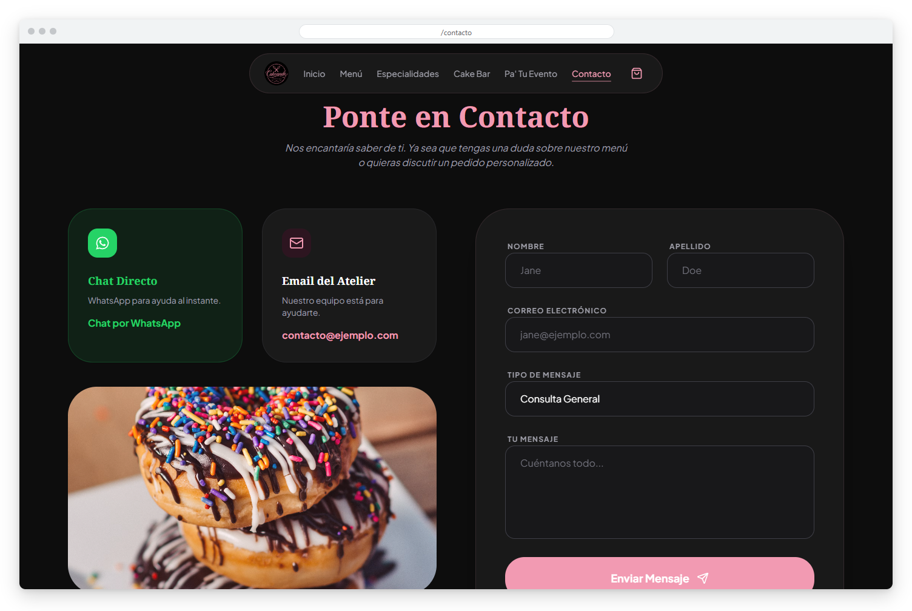
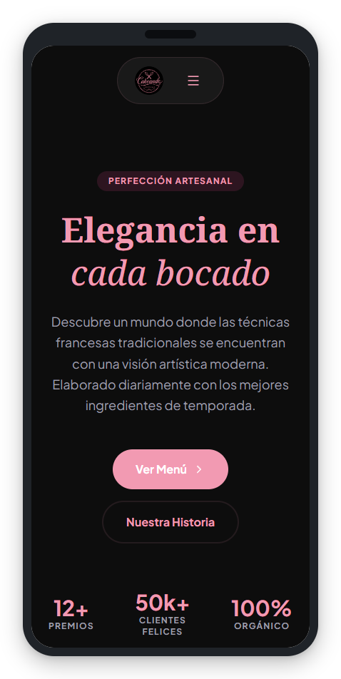
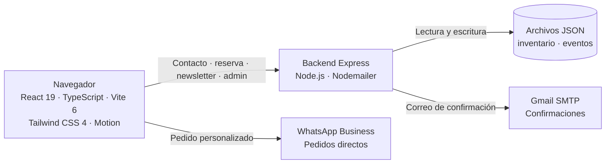

<div align="center">



# Cakeando Sweets Bar


**Sitio web full-stack para una boutique de repostería artesanal en Panamá, con catálogo interactivo, constructor de tortas personalizado y sistema de reservas para eventos.**

**[Ver el sitio en producción](https://cakeandosweetsbar.sytes.net/)**

</div>

> Este es un **portafolio showcase**: el código fuente es propietario y no está incluido.

---

## Contenido

- [El Problema](#el-problema)
- [La Solución](#la-solución)
- [Funcionalidades](#funcionalidades)
- [Vista Previa](#vista-previa)
- [Arquitectura](#arquitectura)
- [Stack Tecnológico](#stack-tecnológico)
- [Instalación local](#instalación-local)
- [Roadmap](#roadmap)
- [Contacto](#contacto)

---

## El Problema

Una pastelería artesanal en Panamá necesitaba una presencia digital que transmitiera el nivel premium de sus productos y le permitiera:

- Mostrar su catálogo con disponibilidad actualizada sin depender de un desarrollador.
- Recibir pedidos personalizados de tortas sin gestión manual de chats.
- Gestionar reservas para su servicio de CakeBar en eventos.
- Actualizar inventario y próximos eventos desde un panel simple.

---

## La Solución

Un sitio web full-stack con React 19 y un backend Express ligero que maneja los correos, la persistencia de inventario y eventos, y el flujo de pedidos hacia WhatsApp, todo integrado en una experiencia de navegación fluida con transiciones animadas entre páginas.

---

## Funcionalidades

| Funcionalidad | Descripción |
|---------------|-------------|
| Constructor de Tortas | Asistente de 5 pasos (Base, Frosting, Relleno, Toppings, Drizzle) que genera un pedido prellenado por WhatsApp |
| Catálogo de Menú | 5 pestañas (Todo, Exclusivo, Cakeando tu Dulce, Cake 8x8, Por Temporada) con disponibilidad desde el inventario |
| Pa' Tu Evento | Paquetes CakeBar (Básico / Premium / Luxury), orden personalizada y formulario de reserva |
| Inicio dinámico | Hero, feed de próximos eventos, colecciones destacadas y registro al newsletter |
| Contacto | Formulario por correo y chat directo por WhatsApp, con botón flotante en todo el sitio |
| Newsletter | Registro de suscriptores con confirmación por correo |
| Panel de Admin | Editor de inventario y eventos, con acceso protegido solo para administradores |
| Páginas informativas y legales | Nuestra Historia, Política de Privacidad y Términos |

---

## Vista Previa



<table>
  <tr>
    <td width="50%">
      
      <br><b>Menú</b>: catálogo de productos con filtros por categoría y precios.
    </td>
    <td width="50%">
      
      <br><b>Especialidades</b>: pedidos especiales como pasteles de bodas.
    </td>
  </tr>
  <tr>
    <td width="50%">
      
      <br><b>Cake Bar</b>: estación interactiva de postres con montaje a medida.
    </td>
    <td width="50%">
      
      <br><b>Pa' Tu Evento</b>: paquetes para celebraciones y formulario de reserva.
    </td>
  </tr>
  <tr>
    <td width="50%">
      
      <br><b>Contacto</b>: formulario por correo y chat directo por WhatsApp.
    </td>
    <td width="50%" align="center">
      
      <br><b>Versión móvil</b>: la página de inicio adaptada a pantallas pequeñas.
    </td>
  </tr>
</table>

---

## Arquitectura



**API REST:** `POST /api/contact`, `POST /api/reservation`, `POST /api/newsletter`, `GET /api/inventory`, `GET /api/events`, y rutas de administración protegidas con HTTP Basic (verificación, inventario y eventos).

La navegación es por estado dentro de `App.tsx` (sin react-router), con transiciones de página mediante `AnimatePresence` de Motion.

---

## Stack Tecnológico

| Capa | Tecnología |
|------|-----------|
| Frontend | React 19 · TypeScript 5.8 · Vite 6 · Tailwind CSS 4 |
| Animaciones | Motion (Framer Motion v12) |
| Iconos | Lucide React · React Icons |
| Backend | Express 4 · Node.js 18+ |
| Correo | Nodemailer + Gmail SMTP |
| Datos | Archivos JSON en el servidor (sin base de datos) |
| Despliegue | Bluehost VPS · PM2 · Nginx |

---

## Instalación local

> **Aviso:** el código es privado y propietario. Estos pasos son solo para colaboradores autorizados con acceso al repositorio.

1. Instala Node.js 18 o superior.
2. Instala las dependencias:
   ```bash
   npm install
   ```
3. Copia `.env.example` a `.env` y completa tus propios valores.
4. Inicia el entorno de desarrollo:
   ```bash
   npm run dev
   ```
5. Para producción, compila y arranca el servidor:
   ```bash
   npm run build:all
   npm start
   ```

---

## Roadmap

- [ ] Reemplazar las imágenes de stock por fotos reales de producto.
- [ ] Carrito y sistema de pedidos en línea (hoy el icono de bolsa es un marcador de posición).
- [ ] Sección de Horarios en la página de Contacto.
- [ ] Cargar eventos reales desde el panel de administración.

---

## Contacto

El código fuente es propietario. Para consultas o propuestas, escríbeme:

[](mailto:pablozam1931@gmail.com)
[%206517--1870-25D366?style=for-the-badge&logo=whatsapp&logoColor=white)](https://wa.me/50765171870)
[](https://github.com/deadlyrat)

- Correo: [pablozam1931@gmail.com](mailto:pablozam1931@gmail.com)
- WhatsApp: [(507) 6517-1870](https://wa.me/50765171870)
- GitHub: [github.com/deadlyrat](https://github.com/deadlyrat)

---

*Parte del portafolio de [deadlyrat](https://github.com/deadlyrat)*
